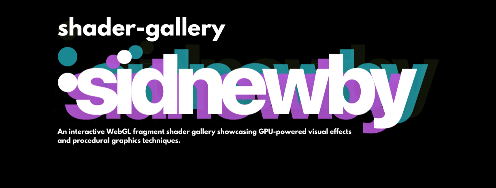

# Shader Gallery


An interactive WebGL fragment shader gallery showcasing GPU-powered visual effects and procedural graphics techniques.


## Features

- **WebGL2 Rendering** — Hardware-accelerated fragment shaders running on the GPU
- **Raymarching** — 3D sphere rendering using signed distance functions (SDFs)
- **Procedural Textures** — Plasma waves, fractal noise, and kaleidoscope patterns
- **Aurora Simulation** — Flowing curtains of light resembling the northern lights
- **Real-time Controls** — Interactive parameter adjustment with live updates
- **Mouse Tracking** — Smooth interpolated mouse input passed to shaders
- **FPS Monitor** — Optional debug overlay for performance tracking
- **Keyboard Navigation** — Quick shader switching and parameter reset

## Tech Stack

- [Next.js](https://nextjs.org/) — React framework
- [React 19](https://react.dev/) — UI library
- [Tailwind CSS v4](https://tailwindcss.com/) — Styling
- [TypeScript](https://www.typescriptlang.org/) — Type safety
- [WebGL2](https://www.khronos.org/webgl/) — Graphics API

## Getting Started

```bash
# Install dependencies
npm install
# or
bun install

# Run development server
npm run dev
# or
bun dev
```

Open [http://localhost:3000](http://localhost:3000) to view the shader gallery.

## Keyboard Shortcuts

| Key | Action |
|-----|--------|
| **Left/Right Arrow** | Cycle through shaders |
| **R** | Reset parameters to defaults |
| **D** | Toggle FPS debug overlay |
| **1-5** | Select specific shader by number |

## Shaders

### 1. Plasma Waves
Classic plasma effect using layered sine waves with vibrant colors. Adjustable speed, scale, and color shift parameters.

### 2. Raymarched Sphere
3D sphere rendered using signed distance functions (SDFs) with Phong lighting, soft shadows, and Fresnel effects. Features adjustable rotation speed, glossiness, and sphere scale.

### 3. Fractal Noise
Layered simplex noise creating organic, flowing patterns. Control octaves, persistence, and zoom level for different noise characteristics.

### 4. Kaleidoscope
Radial symmetry with rotating procedural patterns creating mandala-like visuals. Adjustable segment count, rotation speed, and zoom.

### 5. Aurora Borealis
Flowing curtains of light resembling the northern lights with shimmer effects. Control intensity, speed, and wave height.

## Technical Details

- All shaders are GLSL ES 3.00 fragment shaders
- Vertex shader provides a fullscreen quad
- Standard uniforms: `u_time`, `u_resolution`, `u_mouse`
- Custom uniforms are dynamically defined per shader
- Canvas automatically resizes using ResizeObserver
- Smooth 60 FPS render loop with requestAnimationFrame

## License

MIT
